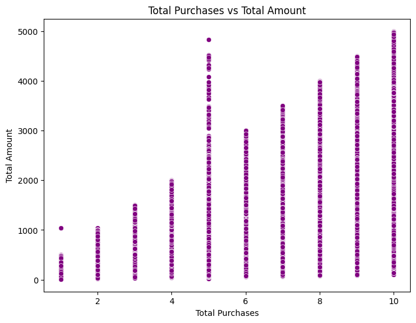

# TechRetail Azure Data Pipeline Analysis

This project, **TechRetail Azure Data Pipeline Analysis**, provides a robust analysis of retail data via an Azure-based data pipeline. Leveraging Power BI and Databricks, it delivers interactive visualizations and insightful data workflows, covering key performance metrics and customer insights.

---

## 📂 Repository Structure

- **📊 PowerBI/**: Includes the Power BI report template (`.pbit`) with interactive dashboards and visualizations.
- **📑 PPT/**: Contains the main presentation file (`TechRetail_AzureDataPipeline.pptx`) and a PDF version summarizing the project findings.
- **📓 Notebook/**: A Databricks notebook that documents the data preprocessing, analysis, and insights generation process.

---

## 📈 Dashboard Preview

---

## 🔍 Analysis Highlights

Below is a collection of key insights from the analysis:

|    **Total Sales Per Quarter Per Year** |    **Distribution of Transaction Amounts** |    **Top Selling Products by Total Sales** |
|------------------------------------------------------------------------------------------------|------------------------------------------------------------------------------------------------|------------------------------------------------------------------------------------------------|
|    **Total Purchases vs Total Amount** |    **Correlation Heatmap** |    **Total Sales Growth Per Year** |

---

## 📁 File Details

### 1. Power BI Template
The **PowerBI** folder includes a `.pbit` template for creating dynamic visualizations and insights. Key sections in the dashboard:
- **Sales Metrics**: KPIs on sales performance.
- **Regional Analysis**: Geographical insights to optimize strategy.
- **Customer Segmentation**: Visual breakdowns of customer demographics.

### 2. Presentation
In the **PPT** folder:
- `TechRetail_AzureDataPipeline.pptx`: A structured presentation covering the project overview, methodology, insights, and conclusions.
- `TechRetail_AzureDataPipeline.pdf`: A PDF version for easy sharing.

### 3. Databricks Notebook
The **notebook** file provides:
- Detailed data preprocessing and feature engineering steps.
- Exploratory Data Analysis (EDA) for uncovering trends and patterns.
- Code documentation for reproducibility.

---

## 🚀 Getting Started

To view and explore the files:
1. **Power BI Report**: Open the `.pbit` file in Power BI Desktop.
2. **Presentation**: Access the PowerPoint or PDF for a concise overview.
3. **Databricks Notebook**: Open in Databricks to explore the analytical workflow.

---

## ⚙️ Prerequisites
- **Power BI Desktop** for viewing the `.pbit` template.
- **Azure Subscription** for utilization of resources
- **Databricks Environment** with necessary libraries.

---

## 📬 Contact
For questions or collaboration inquiries, reach out through my [GitHub profile](https://github.com/arnabsaha7) or via [Email](mailto:arnabsaha9786@gmail.com).
